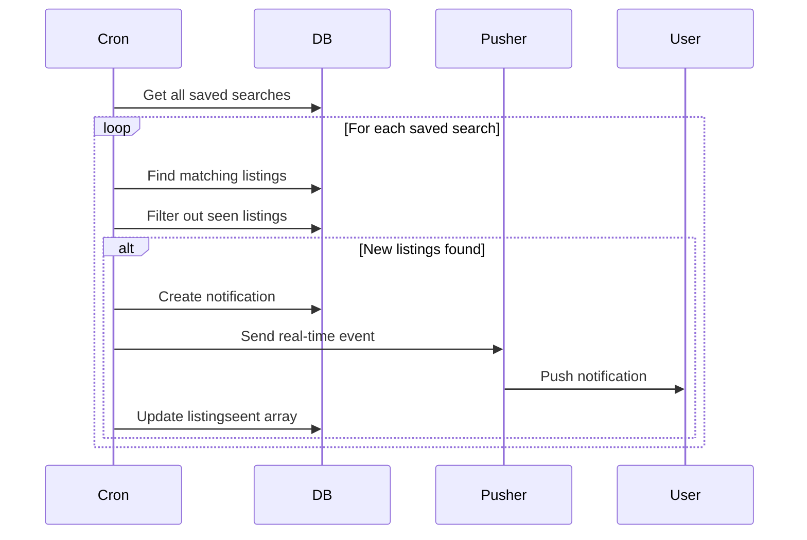

# Saved Search Notification System

## Overview

Automated cron job system that monitors users' saved searches and sends real-time push notifications when new matching listings are added.

## How It Works

### Cron Job Flow



### Key Features

✅ **Automatic Monitoring** - Checks all saved searches periodically  
✅ **Smart Tracking** - Remembers which listings users have already seen  
✅ **Real-Time Notifications** - Instant push via Pusher when matches found  
✅ **No Duplicates** - Won't notify about same listing twice  
✅ **Batch Processing** - Handles all users efficiently in one run

## Files Created

### [app/cron/savedsersh/route.ts](file:///c:/Users/xtrem/Desktop/estate/app/cron/savedsersh/route.ts)
Main cron endpoint that:
- Fetches all saved searches from database
- Builds MongoDB filters from saved query parameters
- Finds new listings matching each search
- Filters out previously seen listings using `listingseent` array
- Creates notifications and sends Pusher events
- Updates `listingseent` with new listing IDs

### [lib/saved-search-helper.ts](file:///c:/Users/xtrem/Desktop/estate/lib/saved-search-helper.ts)
Helper functions:
- `checkSavedSearchForUser()` - Check specific search for one user
- `markListingsAsSeen()` - Mark listings as viewed

### [app/api/saved-search/check/route.ts](file:///c:/Users/xtrem/Desktop/estate/app/api/saved-search/check/route.ts)
Manual check endpoint for users to check their searches on-demand

## Database Schema

The `Seavdsearchuser` model now includes:
```prisma
model Seavdsearchuser {
  id              String    @id @default(auto()) @map("_id") @db.ObjectId
  userId          String
  nameSearch      String    // Name of saved search
  qury            Json      // Search criteria
  listingseent    String[]  // IDs of listings already seen
  email_frequency String
  createdAt       DateTime
  updatedAt       DateTime
}
```

## Running the Cron Job

### Manual Trigger (for testing)

Visit or call:
```
GET http://localhost:3000/cron/savedsersh
```

Response example:
```json
{
  "success": true,
  "message": "Saved search cron job completed",
  "stats": {
    "totalSavedSearches": 15,
    "totalNotificationsSent": 5,
    "totalListingsFound": 12
  },
  "results": [
    {
      "savedSearchId": "...",
      "savedSearchName": "Luxury Villas",
      "userId": "...",
      "newListingsFound": 3,
      "notificationSent": true
    }
  ]
}
```

### Automated Scheduling

#### Option 1: Vercel Cron (Recommended)

Create `vercel.json` in project root:
```json
{
  "crons": [{
    "path": "/cron/savedsersh",
    "schedule": "0 */6 * * *"
  }]
}
```

This runs every 6 hours.

#### Option 2: GitHub Actions

Create `.github/workflows/cron.yml`:
```yaml
name: Saved Search Cron
on:
  schedule:
    - cron: '0 */6 * * *'  # Every 6 hours
  
jobs:
  cron:
    runs-on: ubuntu-latest
    steps:
      - name: Call cron endpoint
        run: |
          curl -X GET https://your-domain.com/cron/savedsersh
```

#### Option 3: External Cron Service

Use services like:
- **cron-job.org** - Free scheduled HTTP requests
- **EasyCron** - Cron as a service
- **AWS EventBridge** - Scheduled Lambda functions

## Testing

### 1. Create a Saved Search

```javascript
// Save a search via the UI or API
fetch('/api/saved-search', {
  method: 'POST',
  headers: { 'Content-Type': 'application/json' },
  body: JSON.stringify({
    nameSearch: 'Test Search',
    url: 'Minimam=100000&Maximam=500000&city=New York'
  })
});
```

### 2. Add Some Matching Listings

Add listings to your database that match the search criteria.

### 3. Run the Cron Manually

```bash
curl http://localhost:3000/cron/savedsersh
```

Or visit in browser:
```
http://localhost:3000/cron/savedsersh
```

### 4. Check for Notification

- Notification bell should update with new count
- Click bell to see notification like:
  > 🏡 3 New Properties Found!
  > 
  > Great news! We found 3 new properties matching your saved search "Luxury Villas". Check them out now!

### 5. Verify No Duplicates

Run the cron again:
```bash
curl http://localhost:3000/cron/savedsersh
```

**Expected**: No new notifications for the same listings (they're tracked in `listingseent`)

## Manual Check API

Users can also manually check their saved searches:

```javascript
fetch('/api/saved-search/check', {
  method: 'POST',
  headers: { 'Content-Type': 'application/json' },
  body: JSON.stringify({
    savedSearchId: 'your-saved-search-id'
  })
}).then(r => r.json()).then(console.log);
```

## Notification Example

When new listings match a saved search, users receive:

**Title**: 🏡 3 New Properties Found!

**Message**: Great news [Username]! We found 3 new properties matching your saved search "Luxury 3BR Apartments". Check them out now!

**Link**: Clicking navigates to the search results page with the saved filters applied

**Metadata**:
```json
{
  "savedSearchId": "...",
  "savedSearchName": "Luxury 3BR Apartments",
  "listingCount": 3,
  "listingIds": ["id1", "id2", "id3"]
}
```

## Query Parameters Supported

The cron job supports all search parameters:

- `Minimam` / `Maximam` - Price range
- `Bads` - Minimum bedrooms (e.g., "3+")
- `Baths` - Minimum bathrooms (e.g., "2+")
- `Status` - Listing status (active, pending, etc.)
- `listing_type` - "Rentals" or "Sales"
- `city` - City name
- `address` - Street address search

## Performance Considerations

- **Batch Size**: Checks up to 10 new listings per saved search
- **Concurrent**: Processes all saved searches sequentially
- **Database**: Uses MongoDB's `$runCommandRaw` for efficient filtering
- **Pusher**: Sends events asynchronously
- **Tracking**: `listingseent` array prevents duplicate processing

## Troubleshooting

### No Notifications Received

1. Check cron executed: Look for console logs
2. Verify saved searches exist: Check database
3. Confirm matching listings: Run search manually
4. Check Pusher connection: Verify WebSocket active
5. Review `listingseent`: Ensure listings not already tracked

### Duplicate Notifications

- Ensure `listingseent` array is being updated
- Check database schema has the field
- Run `npx prisma generate` to update Prisma client

### Performance Issues

- Limit number of saved searches per user
- Increase cron interval (run less frequently)
- Add pagination for large result sets
- Consider background job queue for scaling

## Monitoring

Add logging to track cron performance:

```typescript
// In your monitoring service
fetch('/cron/savedsersh')
  .then(r => r.json())
  .then(data => {
    console.log('Cron Stats:', data.stats);
    // Log to monitoring service
    logToDatadog(data.stats);
  });
```

## Future Enhancements

- Email digests based on `email_frequency` setting
- Push notifications for mobile apps
- User preferences for notification types
- Unsubscribe from specific saved search notifications
- Smart throttling (don't notify too frequently)
- Price change alerts for tracked properties
